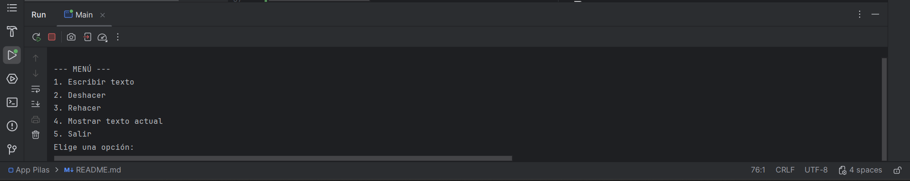
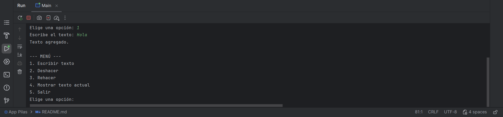
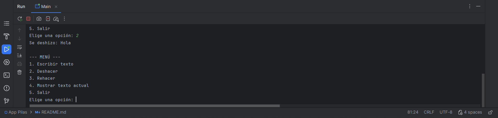
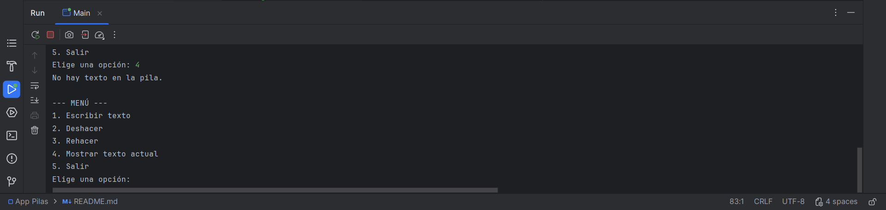
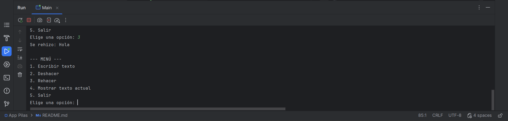
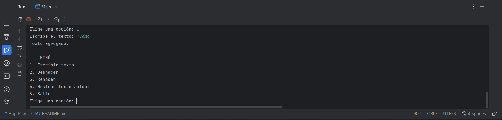
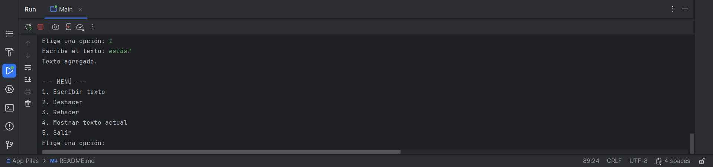
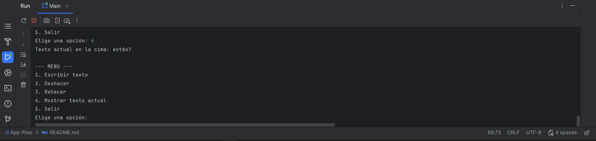
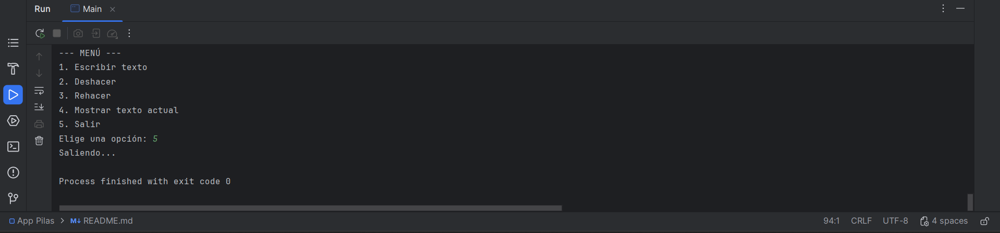

# Proyecto: Simulador de Deshacer/Rehacer con Pilas en Java

## 🎯 Objetivo del proyecto
Comprender el concepto de **pila** y su estructura, aplicándolo en un simulador de **deshacer/rehacer** en un editor de texto simple, implementado en **Java**.  
Además, se busca el uso de **buenas prácticas de control de versiones con GitHub**.

---
## 📖 Concepto de Pila y su relación con Undo/Redo

### 🔹 ¿Qué es una pila?
Una **pila** es una estructura de datos que organiza la información siguiendo la regla **LIFO (Last In, First Out)**, es decir:  
👉 *el último elemento en entrar es el primero en salir*.

Ejemplo simple:
- Imagina una pila de platos.
- Colocas un plato encima de otro (eso es un **push**).
- Para sacar un plato, siempre tomarás el de arriba (eso es un **pop**).

### 🔹 Operaciones básicas de una pila
- **push()** → Agregar un elemento en la cima.
- **pop()** → Eliminar el elemento en la cima.
- **peek()** → Ver el elemento en la cima sin eliminarlo.
- **isEmpty()** → Verificar si la pila está vacía.

### 🔹 ¿Cómo se aplica al Undo/Redo?
En un editor de texto, cuando escribimos y deshacemos, utilizamos dos pilas:

1. **Pila Principal** → Guarda los textos escritos.
    - Cada vez que el usuario escribe algo, se hace un **push** en esta pila.
    - Al deshacer (Undo), se hace un **pop** y ese elemento pasa a la pila secundaria.

2. **Pila Secundaria** → Guarda lo que se deshizo.
    - Permite recuperar con la acción de rehacer (Redo).
    - Al rehacer, se hace un **pop** en la pila secundaria y un **push** nuevamente en la pila principal.

De esta forma:
- **Undo (Ctrl + Z)** → quita lo último hecho y lo guarda para rehacer.
- **Redo (Ctrl + Y)** → recupera lo último deshecho y lo devuelve a la pila principal.

👉 Gracias a este uso de pilas, el programa puede manejar los cambios en orden correcto, respetando siempre el principio **LIFO** (Último en entrar, primero en salir).

---

## 🛠️ Instrucciones de ejecución

### 1. Preparar el entorno
1. Instala **Java Development Kit (JDK 8 o superior)**:
    - [Descargar JDK](https://www.oracle.com/java/technologies/downloads/)
    - Verifica la instalación con:
      ```bash
      java -version
      javac -version
      ```

2. Instala **IntelliJ IDEA (Community o Ultimate)**:
    - [Descargar IntelliJ IDEA](https://www.jetbrains.com/idea/download/)

3. Crea o inicia sesión en tu cuenta de **GitHub**:
    - [Acceder a GitHub](https://github.com)

---

### 2. Clonar el repositorio desde IntelliJ IDEA
1. Abre IntelliJ IDEA.
2. En la pantalla inicial, selecciona **Get from VCS (Version Control System)**.
3. En el campo de URL, pega la dirección del repositorio en GitHub:
   https://github.com/IUDevgorjs/apppilas.git
4. Elige la carpeta de destino en tu equipo.
5. Haz clic en **Clone**.

IntelliJ descargará automáticamente el proyecto y lo abrirá en tu entorno de desarrollo.

---

### 3. Configurar el SDK de Java en el proyecto
1. Ve a **File > Project Structure > Project SDK**.
2. Selecciona el **JDK** instalado en tu equipo (mínimo Java 8).
3. Aplica los cambios con **OK**.

---

### 4. Ejecutar el programa
1. En el panel lateral, busca la clase `Main.java`.
2. Haz clic derecho sobre ella y selecciona **Run 'Main.main()'**.
3. Se abrirá la consola de IntelliJ mostrando el siguiente menú interactivo:


--- MENÚ ---

Escribir texto

Deshacer

Rehacer

Mostrar texto actual

Salir
Elige una opción:


4. Usa el teclado para probar las distintas funcionalidades:
    - **Escribir texto** → Agrega un nuevo texto en la pila principal.
    - **Deshacer** → Quita el último texto y lo guarda en la pila secundaria.
    - **Rehacer** → Recupera el último texto deshecho.
    - **Mostrar texto actual** → Muestra el elemento en la cima de la pila principal.
    - **Salir** → Finaliza el programa.
---

## 📸 Capturas de pantalla de la ejecución

### Menú principal


### Ejemplo de escritura y deshacer




### Ejemplo de rehacer


### Agregando más palabras y mostrando el elemento en la cima de la Pila




### Salir de programa



---
## 📖 Explicación del código fuente

El código está organizado en una estructura sencilla:

### 🔹 Clase `Main`
- Contiene el método `main`, el cual inicializa el menú interactivo en consola.
- Se utiliza un objeto **`Scanner`** para capturar las opciones ingresadas por el usuario.

### 🔹 Estructuras de datos utilizadas
- **`Stack<String> pilaPrincipal`**  
  Guarda los textos escritos en el simulador.
- **`Stack<String> pilaSecundaria`**  
  Guarda los textos que se eliminan al usar **Deshacer**, para permitir el **Rehacer**.

### 🔹 Flujo principal del programa
1. **Escribir texto (`opción 1`)**  
   El texto ingresado se añade con `push()` a la **pila principal**.
2. **Deshacer (`opción 2`)**  
   El último texto de la pila principal se extrae con `pop()` y se pasa a la **pila secundaria**.
3. **Rehacer (`opción 3`)**  
   El texto en la cima de la pila secundaria se extrae con `pop()` y se inserta de nuevo en la **pila principal**.
4. **Mostrar texto (`opción 4`)**  
   Se consulta el texto actual sin eliminarlo usando `peek()` en la pila principal.
5. **Salir (`opción 5`)**  
   El programa imprime un mensaje de salida `"Saliendo..."`, termina el bucle principal y cierra los recursos abiertos.

### 🔹 Manejo de errores
- Si el usuario ingresa una opción inválida, se muestra un mensaje de advertencia y se repite el menú.
- Si intenta **Deshacer** cuando la pila principal está vacía, o **Rehacer** cuando la pila secundaria está vacía, también se muestra un mensaje informativo.

Esta lógica refleja cómo funcionan realmente las operaciones de **Undo/Redo** en aplicaciones reales.
___
## 👥 Contribuyentes

Proyecto realizado por:

- Diego Fernando Rojas Molina
